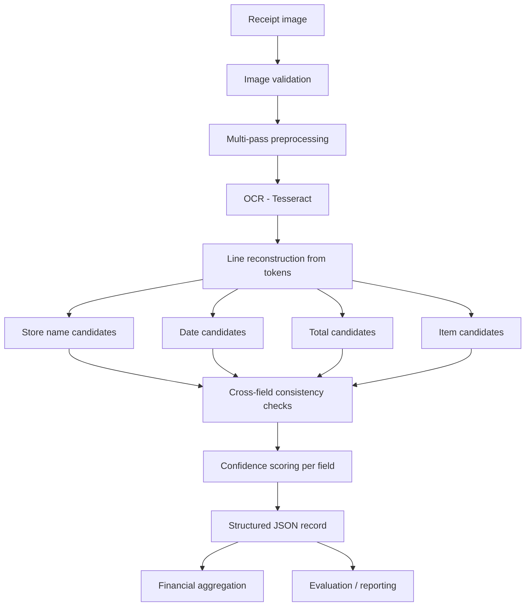

# Receipt Vision

A confidence-aware information extraction system for semi-structured
receipt images: OCR → field extraction → validation → explainable
confidence scoring → structured JSON → financial summary.

## What this actually does

Given a directory of receipt images, the pipeline:

1. Validates each image (rejects missing/corrupt/too-small files without crashing)
2. Preprocesses it with a measured, not assumed, strategy (see [Preprocessing](#preprocessing))
3. Runs Tesseract OCR and keeps per-word confidence and position
4. Extracts store name, date, line items, and total amount using
   layout-aware heuristics (not a single fragile regex)
5. Cross-checks the extracted fields against each other (do item prices
   roughly sum to the total?)
6. Scores every field's confidence from named, inspectable components
   (never an opaque number)
7. Writes one structured JSON record per receipt, plus a financial
   summary and an evaluation report across the whole batch

## Why it's built this way

This project deliberately avoids several tempting shortcuts:
don't assume preprocessing always helps, don't force uncertain fields
into confident-looking answers, don't fabricate accuracy numbers. This
repository tries to take those seriously rather than treat them as
boilerplate:

- **Preprocessing is chosen by evidence, not assumption.** An actual
  experiment (`experiments/run_preprocessing_experiment.py`) compares
  three named strategies on a sample of the dataset. The result was
  counter-intuitive: heavier preprocessing ("full": denoise + CLAHE +
  deskew + adaptive threshold) picked up *more* OCR tokens but at
  *lower* mean confidence than doing nothing. See
  [Results](#results-measured-on-this-dataset).
- **No ground-truth labels ship with the dataset** (verified by
  inspection - see `data/README.md`), so the evaluation report never
  states an accuracy percentage. It reports what can honestly be
  measured (field coverage, OCR confidence distribution, item/total
  consistency rate) and generates a manual-review CSV for a human to
  establish real accuracy figures.
- **Confidence is a sum of named components**, not a single learned or
  guessed number. Every field's confidence breakdown (OCR score,
  keyword match, pattern validity, positional evidence, consistency
  signal) is available in each record's `meta.confidence_components`.

## Architecture



```
src/
  preprocessing/   image loading+validation, denoise/deskew/contrast strategies
  ocr/             OCR engine interface + Tesseract implementation
  extraction/      store name / date / total / item candidate detection
  confidence/      component-based confidence scoring
  validation/      cross-field consistency checks (item sum vs total, etc.)
  aggregation/      financial summary across all receipts
  evaluation/       coverage/consistency reporting + manual review sampling
  pipeline/         per-receipt orchestration + multi-pass OCR policy
  utils/           config loading, logging, the JSON data contract
tests/             65 tests covering every module above
experiments/       preprocessing strategy comparison script + results
configs/           default.yaml - every tunable value in one place
docs/              1-2 page technical writeup
```

## OCR engine: why Tesseract

Tesseract, EasyOCR and PaddleOCR were all considered. This
project uses **Tesseract** for a concrete, checkable reason: the other
two need to download large pretrained model weights from hosts not
reachable in this project's execution environment, which would make the
pipeline fail to even start for anyone re-running it in a similarly
sandboxed or offline setting. Tesseract ships as a plain system package
with per-word confidence built in (`image_to_data`), which is exactly
what the confidence-scoring requirement needs.

The engine sits behind `src/ocr/engine.py`'s `OCREngine` interface
specifically so this decision is reversible - swapping in EasyOCR or
PaddleOCR later means implementing one class, not touching extraction,
confidence, or anything downstream.

## Preprocessing

Six operations (`src/preprocessing/pipeline.py`): grayscale, resize
(up for small images, down for huge ones), denoise, illumination
normalization, CLAHE contrast enhancement, deskew (via minAreaRect on
thresholded text mass), and adaptive thresholding. These combine into
three named strategies:

| Strategy | Steps |
|---|---|
| `raw` | grayscale + resize only |
| `clahe_deskew` | + contrast enhancement + deskew |
| `full` | + illumination norm + denoise + adaptive threshold |

**Multi-pass policy** (`src/pipeline/ocr_pass.py`): try `raw` first; if
OCR confidence or token count is too low, escalate to `clahe_deskew`,
then `full`. This is not "run every strategy every time" - it is a
cheapest-first policy that only pays for heavier preprocessing when the
cheap pass looks unreliable.

## Confidence scoring

Every field gets a confidence score built from named components, with
configurable weights in `configs/default.yaml`:

```json
"total_amount": {
  "value": 15.00,
  "confidence": 0.825,
  "status": "medium"
}
```

with the full breakdown available in `meta.confidence_components`:

```json
"total_amount": {
  "ocr_score": 0.90,
  "keyword_score": 0.55,
  "pattern_score": 1.0,
  "consistency_score": 1.0
}
```

Status buckets: `high` (≥0.85), `medium` (≥0.70), `low` (<0.70, per the
configured low-confidence flagging threshold), `missing` (no value found), or
`ambiguous` (multiple materially conflicting candidates - reported with
alternatives instead of guessing).

Weights are reasoned defaults documented in
`docs/technical_documentation.md`, not values fit to labelled data -
there is no labelled dataset here to fit them against, and that
limitation is stated rather than hidden.

## Reliability example (real output, not constructed)

Receipt `X51005705727` demonstrates the system working as intended on a
genuinely hard case - a receipt with a confusing tax/quantity breakdown
where multiple lines contain a "total"-like keyword:

```json
"total_amount": {
  "value": 2.16,
  "confidence": 0.4513,
  "status": "ambiguous",
  "alternatives": [{"value": 38.15, "line": "dt Total : 38.15"}]
},
"warnings": [
  "item prices (sum=118.16) do not reconcile with total (total=2.16, delta=116.0); could be tax/discount/rounding or an extraction error"
]
```

The extractor picked the wrong candidate here - but instead of quietly
reporting `2.16` as fact, low confidence, `ambiguous` status, the
correct alternative, and an explicit consistency warning all surfaced
together. That is exactly the reliability behavior a confidence-aware
system should have: **flag uncertainty instead of hiding it.**

## Results (measured on this dataset)

Full run over all 370 provided images (see `outputs/` after running the
pipeline yourself for the current numbers):

| Metric | Value |
|---|---|
| Receipts processed | 370 / 370 (0 crashes) |
| Store name found | 98.9% |
| Date found | 59.5% |
| Total amount found | 90.8% |
| At least one item found | 53.8% |
| Mean OCR confidence | 74.1 (range 39.0-90.5) |
| Preprocessing pass usage | raw: 359, clahe_deskew: 7, full: 4 |
| Item/total consistency pass rate* | 40.1% (of receipts where both were extracted) |
| Reported total spend (all totals, any confidence) | RM/local-currency 27,020.42 |
| Included total spend (confidence ≥ 0.50, non-ambiguous) | 15,156.51 |

\* "Pass" = item prices summed within tolerance of the printed total.
This is deliberately a low bar to clear given how heuristic item
extraction is (see Limitations) - the number is reported so the gap is
visible, not smoothed over.

**These are coverage and consistency statistics, not accuracy.** No
ground-truth labels exist for this dataset (confirmed by inspection),
so no accuracy percentage is claimed anywhere in this repository. See
`outputs/reports/manual_review_sample.csv` for a template to establish
real accuracy by hand-checking a sample against the source images.

### Preprocessing experiment (n=30 sample, `experiments/preprocessing_comparison.csv`)

| Strategy | Mean OCR confidence | Mean tokens | Mean runtime (s) |
|---|---|---|---|
| raw | 73.2 | 129.9 | 1.18 |
| clahe_deskew | 71.8 | 135.1 | 1.23 |
| full | 67.8 | 148.6 | 1.99 |

Heavier preprocessing found more text but with lower average confidence
- likely because adaptive thresholding picks up more marginal,
low-confidence tokens rather than cleaning up the clear ones. This is
why `raw` is tried first in the multi-pass policy rather than assumed
to be worse.

## Limitations (stated, not hidden)

- **No ground truth, so no accuracy metric.** Coverage and consistency
  are measured; correctness is not, until someone fills in the manual
  review CSV.
- **Line-item extraction is the weakest field.** Multi-line item
  descriptions (e.g. a weighted item printed as "description" on one
  line and "qty @ unit price" on the next) are not reliably merged into
  one item; each fragment may be scored as a separate, lower-confidence
  candidate instead. Items also can't be extracted at all from OCR text
  that garbles the trailing price - which is a real limitation of this
  dataset's noisier images, not something the item parser can fix on its
  own.
- **Store name is a heuristic, not a classifier.** It occasionally picks
  a confident-looking non-brand line (e.g. "SUPERCENTER" instead of a
  stylised, low-OCR-confidence logo like "WAL★MART") when the true
  store name renders poorly. The confidence score for that field is
  correspondingly lower in exactly those cases.
- **Date coverage is 59.5%**, not because of a scoring bug but because a
  meaningful fraction of receipts in this dataset don't have a cleanly
  OCR-able date string at all (faded thermal print, cropped edges).
- **Confidence calibration was not attempted.** Whether "0.85 confidence"
  actually means "85% likely correct" cannot be checked without labels.

## Setup

```bash
pip install -r requirements.txt
# Tesseract must also be installed as a system package, e.g.:
#   apt-get install tesseract-ocr        (Debian/Ubuntu)
#   brew install tesseract                (macOS)
```

Place receipt images under `data/receipts/` (see `data/README.md`).

## Run

```bash
python run_pipeline.py
```

Useful flags:

```bash
python run_pipeline.py --data-dir path/to/images --output-dir path/to/outputs
python run_pipeline.py --limit 20                 # smoke test on the first 20 images
python run_pipeline.py --config configs/default.yaml
```

The pipeline processes each image independently and writes progressively,
so it can be safely re-run in chunks with `--start-index N --limit M
--append` on a large dataset without redoing already-processed receipts.

## Test

```bash
python -m pytest tests/ -v
```

65 tests across preprocessing, date/total/item extraction, confidence
scoring, the JSON schema, financial aggregation, and edge cases (missing
files, corrupt images, blank images, malformed config).

## Preprocessing experiment

```bash
python experiments/run_preprocessing_experiment.py --sample-size 40
```

## Output locations

| Path | Contents |
|---|---|
| `outputs/json/<receipt_id>.json` | One structured record per receipt |
| `outputs/summary/financial_summary.json` | Total/per-store spend, transaction counts |
| `outputs/reports/evaluation_report.json` | Coverage, OCR confidence, consistency stats |
| `outputs/reports/manual_review_sample.csv` | Template for hand-verifying a sample |
| `outputs/reports/pipeline.log` | Per-receipt processing log (no raw OCR text logged) |

## Example JSON output

```json
{
  "receipt_id": "X51005705727",
  "store_name": {"value": "KEDAI BUKU NEW ACHEIVERS", "confidence": 0.916, "status": "high"},
  "date": {"value": "2017-12-28", "confidence": 0.975, "status": "high"},
  "items": [
    {"name": "9555078912508 1 40.00 42.16", "price": "40.00", "confidence": 0.8895, "status": "high"}
  ],
  "total_amount": {"value": 2.16, "confidence": 0.4513, "status": "ambiguous",
                    "alternatives": [{"value": 38.15, "line": "dt Total : 38.15"}]},
  "warnings": ["item prices (sum=118.16) do not reconcile with total (total=2.16, delta=116.0); ..."],
  "meta": { "processing_time_sec": 1.65, "ocr_pass": "raw", "ocr_mean_confidence": 75.42, "...": "..." }
}
```

## Future improvements

- Multi-line item merging (associate a description line with a price
  line beneath it) would likely raise item coverage the most for the
  least added complexity.
- A small labelled sample (even 30-40 hand-annotated receipts) would let
  the confidence weights be tuned against real correctness instead of
  reasoned defaults, and would enable real accuracy/calibration metrics.
- A learned or dictionary-based store-name classifier would help on the
  stylised-logo failure case described above.
- Layout-based item-price association (nearest-price-token-by-x-position
  rather than "trailing number on the same OCR line") would handle
  multi-column receipts better.